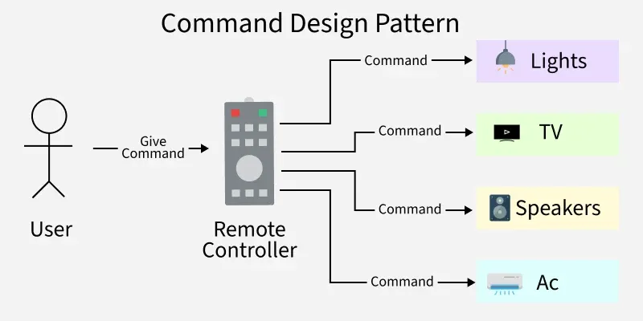

# Command Pattern



#### Пример:
Имаме проста игра, в която от конзолата приемаме дали нашия играч се движи, скача или стреля
 - move \<x-axis> \<y-axis>
 - shoot \<target>
 - jump
 - exit

```c++
class Player {
public:
    void move(int dx, int dy) {
        cout << "Player moves (" << dx << ", " << dy << ")\n";
    }

    void shoot(int target) {
        cout << "Player shoots target " << target << "\n";
    }

    void jump() {
        cout << "Player jumps\n";
    }
};
```
```c++
class Command {
public:
    virtual void execute() = 0;
    virtual ~Command() = default;
};
```
```c++
class MoveCommand : public Command {
    Player& player;
    int dx, dy;

public:
    MoveCommand(Player& p, int dx, int dy)
        : player(p), dx(dx), dy(dy) {}

    void execute() override {
        player.move(dx, dy);
    }
};
```
```c++
class ShootCommand : public Command {
    Player& player;
    int target;

public:
    ShootCommand(Player& p, int t)
        : player(p), target(t) {}

    void execute() override {
        player.shoot(target);
    }
};
```
```c++
class JumpCommand : public Command {
    Player& player;

public:
    JumpCommand(Player& p)
        : player(p) {}

    void execute() override {
        player.jump();
    }
};
```
```c++
vector<string> readAndSplit() {
    string line;
    cout << "> ";
    getline(cin, line);

    return split(line);
}

int main() {
    Player p;
    unique_ptr<Command> cmdPtr = nullptr;
    while (true) {
        vector<string> tokens = readAndSplit();

        if (tokens.empty())
            continue;

        if (tokens[0] == "exit") {
            cout << "Exited program\n";
            return 0;
        }

        string cmd = t[0];

        if(cmd == "move") {
            cmdPtr = make_unique<MoveCommand>(player, stoi(t[1]), stoi(t[2])); 
        } else if (cmd == "shoot") {
            cmdPtr = make_unique<ShootCommand>(player, stoi(t[1]));
        } else if (cmd == "jump") {
            cmdPtr = make_unique<JumpCommand>(player);
        }

        if (cmd)
            cmd->execute();
        else
            cout << "Unknown command\n";
    }
}
```